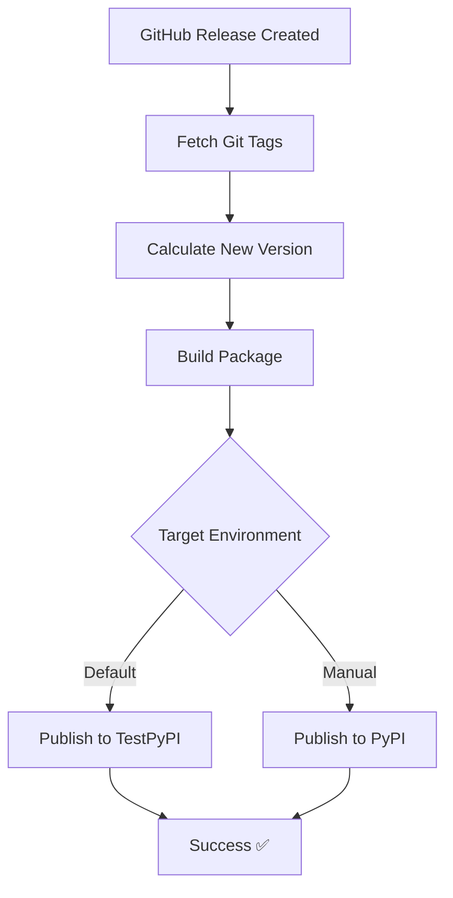

# Deployment & Publishing Guide

This document describes the automated deployment and publishing workflows for the VCS Metrics package.

## 📋 Table of Contents
- [Overview](#overview)
- [Python Package Publishing](#python-package-publishing)
- [Documentation Deployment](#documentation-deployment)
- [Version Control System](#version-control-system)
- [Environments](#environments)
- [Troubleshooting](#troubleshooting)

---

## 🎯 Overview

The VCS Metrics project uses **industry-standard CI/CD pipelines** that handle:

- ✅ **Continuous testing** on every commit/PR
- ✅ **Controlled releases** via GitHub Releases
- ✅ **Semantic versioning** via commit messages and tags
- ✅ **Automated publishing** to TestPyPI/PyPI
- ✅ **Documentation deployment** to GitHub Pages
- ✅ **Zero manual version management**

## 🏗️ Workflow Architecture

```
┌─────────────┐    ┌──────────────┐    ┌─────────────────┐
│   PR/Push   │───▶│ Test Workflow │───▶│ ✅ Fast Feedback │
│   to main   │    │ (test.yml)    │    │   (~2-3 min)    │
└─────────────┘    └──────────────┘    └─────────────────┘

┌─────────────┐    ┌──────────────┐    ┌─────────────────┐
│ GitHub      │───▶│ Publish      │───▶│ 📦 TestPyPI     │
│ Release     │    │ Workflow     │    │ 🚀 Production   │
└─────────────┘    │ (publish.yml)│    └─────────────────┘
                   └──────────────┘
```

---

## 📦 Python Package Publishing

### Workflow Triggers
The publishing workflow runs on:
- **GitHub Releases** → Publishes to TestPyPI
- **Version Tags** (v*.*.*) → Publishes to TestPyPI  
- **Manual Dispatch** → Choose TestPyPI or PyPI

### Automated Process
1. **Version Calculation**: Uses git tags + semantic versioning
2. **Package Building**: Creates wheel and source distributions
3. **Publishing**: Uses OpenID Connect (Trusted Publishing) for secure deployment

### Publishing Flow


---

## 🔢 Version Control System

### Semantic Versioning
We use [Semantic Versioning](https://semver.org/) with **automated version bumps** based on commit messages:

| Commit Message Format | Version Bump | Example |
|----------------------|--------------|---------|
| `patch: description` | Patch (bug fixes) | `1.0.4 → 1.0.5` |
| `minor: description` | Minor (new features) | `1.0.4 → 1.1.0` |
| `major: description` | Major (breaking changes) | `1.0.4 → 2.0.0` |
| `anything else` | Patch (default) | `1.0.4 → 1.0.5` |

### Examples
```bash
# Bug fix
git commit -m "patch: fix calculation error in NAS metric"

# New feature  
git commit -m "minor: add support for custom similarity thresholds"

# Breaking change
git commit -m "major: redesign API for better performance"

# Flexible formatting (all valid)
git commit -m "patch: fix issue"
git commit -m " PATCH : fix issue"  
git commit -m "patch: fix issue"
```

### Technical Implementation
- **Git Tags**: Store version history (`v1.0.5`, `v1.1.0`, etc.)
- **setuptools-scm**: Generates package version from git tags
- **tag_version.py**: Parses commit messages and creates appropriate tags
- **No version conflicts**: Dynamic versioning eliminates local/remote sync issues

---

## 🌍 Environments

### TestPyPI (Staging)
- **URL**: https://test.pypi.org/project/vcs-metrics/
- **Purpose**: Automated testing of package releases
- **Trigger**: Every push to `main` branch
- **Authentication**: Trusted Publishing (OIDC)

### PyPI (Production)
- **URL**: https://pypi.org/project/vcs-metrics/
- **Purpose**: Production package distribution
- **Trigger**: Manual workflow dispatch or tag-based release
- **Authentication**: Trusted Publishing (OIDC)

### GitHub Pages (Documentation)
- **URL**: https://hdubey-debug.github.io/vcs/
- **Purpose**: Public documentation hosting
- **Trigger**: Push to `main` branch (docs changes)
- **Content**: Sphinx-generated API docs and user guides

---

## 🔧 Developer Workflow

### For Contributors
1. **Clone repository**
   ```bash
   git clone https://github.com/hdubey-debug/vcs.git
   cd vcs
   ```

2. **Create feature branch**
   ```bash
   git checkout -b feature/new-metric
   ```

3. **Make changes** to `src/vcs/` directory

4. **Commit with semantic message**
   ```bash
   git commit -m "minor: add new similarity metric"
   ```

5. **Push and create PR**
   ```bash
   git push origin feature/new-metric
   # Create PR via GitHub UI
   ```

6. **After PR merge**: Tests run automatically (no publishing)

### For Maintainers

#### **Creating Releases**

##### **TestPyPI Release** (Recommended)
1. **Create GitHub Release**:
   ```bash
   # Via GitHub UI:
   # Go to Releases → "Create a new release"
   # Tag: v1.2.0, Title: "Release v1.2.0"
   # Description: What changed
   # Click "Publish release"
   ```

2. **Or via CLI**:
   ```bash
   gh release create v1.2.0 \
     --title "Release v1.2.0" \
     --notes "## What's New\n- Feature A\n- Bug fix B"
   ```

3. **Automatic Result**: Package published to TestPyPI

##### **PyPI Release** (Production)
1. **Manual Trigger**:
   - Go to Actions → "Build and Publish"
   - Click "Run workflow"
   - Select "pypi"
   - Click "Run workflow"

##### **Tag-Based Release**
```bash
# Create and push version tag
git tag -a v1.2.0 -m "Release v1.2.0"
git push origin v1.2.0
# → Automatic TestPyPI publishing
```

---

## 🏗️ Infrastructure

### GitHub Actions Workflows
- **`.github/workflows/test.yml`**: Continuous testing (every PR/push)
- **`.github/workflows/publish.yml`**: Release publishing (GitHub releases)
- **`.github/workflows/docs.yml`**: Documentation deployment

### Security
- **Trusted Publishing**: No API keys stored in repository
- **OpenID Connect**: Secure, short-lived tokens
- **Principle of least privilege**: Minimal required permissions

### Monitoring
- **Workflow status**: Visible in GitHub Actions tab
- **Package status**: Check TestPyPI/PyPI for successful uploads
- **Documentation**: Verify GitHub Pages deployment

---

## 🐛 Troubleshooting

### Common Issues

#### "Version already exists" Error
```bash
ERROR: HTTPError: 400 Bad Request from https://test.pypi.org/legacy/
```
**Cause**: Trying to publish an existing version  
**Solution**: Version bump will be handled automatically on next commit

#### "Permission denied" Error
```bash
ERROR: HTTPError: 403 Forbidden
```
**Cause**: Trusted Publishing not configured  
**Solution**: Set up Trusted Publisher on PyPI/TestPyPI

#### "No tags found" Error
```bash
fatal: No names found, cannot describe anything
```
**Cause**: No git tags in repository  
**Solution**: Automatic - system will create initial tag

### Debug Commands
```bash
# Check current version that would be generated
python tag_version.py

# List all version tags
git tag -l v*.*.* | sort -V

# Check package build locally
python -m build

# Verify package contents
tar -tf dist/vcs_metrics-*.tar.gz
```

---

## 📚 Additional Resources

- [Semantic Versioning Specification](https://semver.org/)
- [PyPI Trusted Publishing Guide](https://docs.pypi.org/trusted-publishers/)
- [setuptools-scm Documentation](https://setuptools-scm.readthedocs.io/)
- [GitHub Actions Documentation](https://docs.github.com/en/actions)

---

## 🔄 Workflow Summary

### **Development Flow**
```
Developer PR → Tests run → Merge to main → Ready for release
```

### **Release Flow**  
```
GitHub Release → Version calculated → Package built → Published to TestPyPI → Production ready
```

### **Production Flow**
```
Manual trigger → Select PyPI → Package published → Live on PyPI
```

This **industry-standard pipeline** ensures:
- ✅ **Fast feedback** during development
- ✅ **Controlled releases** when ready
- ✅ **Secure publishing** via Trusted Publishing
- ✅ **Zero manual version management**