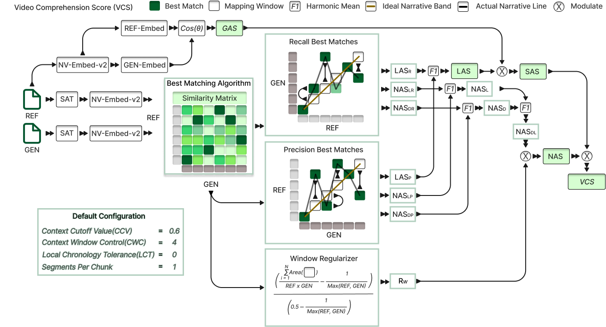

<div align="center">
  <h1 align="center">Video Comprehension Score (VCS)</h1>
  <a href="https://github.com/hdubey-debug/vcs">
    
  </a>
  <p align="center">
    <em>A Comprehensive Python Library for Narrative Similarity Evaluation between two very long descriptions </em>
    <br />
  </p>
</div>

<div align="center">

[](https://badge.fury.io/py/vcs-metrics)
[](https://www.python.org/downloads/)
[](https://opensource.org/licenses/MIT)
[](https://hdubey-debug.github.io/vcs/)

</div>

<p align="center">
  <a href="https://github.com/hdubey-debug/vcs/issues">🐛 Report Bug</a>
  ·
  <a href="https://github.com/hdubey-debug/vcs/discussions">💬 Community Q&A</a>
</p>

---
## 🌟 Key Features

Click on a feature to learn more.

<table width="100%" align="center" style="border: none; border-collapse: collapse;">
  <tr style="background-color: transparent;">
    <td style="padding: 10px; border: none; vertical-align: top;">
      <details style="border: 1px solid #14b8a6; border-radius: 12px; padding: 20px; background: linear-gradient(145deg, #1f2937, #111827); color: #e5e7eb; box-shadow: 0 4px 6px rgba(0, 0, 0, 0.1);">
        <summary style="cursor: pointer; font-weight: bold; font-size: 1.2em; color: #6ee7b7;">🌍 Global Alignment (GAS)</summary>
        <p style="padding-top: 10px;">Measures semantic similarity at the full-text level using advanced embeddings. It provides a holistic view of how well the generated text captures the overall meaning of the reference text.</p>
      </details>
    </td>
    <td style="padding: 10px; border: none; vertical-align: top;">
      <details style="border: 1px solid #14b8a6; border-radius: 12px; padding: 20px; background: linear-gradient(145deg, #1f2937, #111827); color: #e5e7eb; box-shadow: 0 4px 6px rgba(0, 0, 0, 0.1);">
        <summary style="cursor: pointer; font-weight: bold; font-size: 1.2em; color: #6ee7b7;">🎯 Local Alignment (LAS)</summary>
        <p style="padding-top: 10px;">Evaluates segment-by-segment semantic similarity with optimal matching. This is crucial for understanding if specific details and events are correctly represented in the generated text.</p>
      </details>
    </td>
  </tr>
  <tr style="background-color: transparent;">
    <td style="padding: 10px; border: none; vertical-align: top;">
      <details style="border: 1px solid #14b8a6; border-radius: 12px; padding: 20px; background: linear-gradient(145deg, #1f2937, #111827); color: #e5e7eb; box-shadow: 0 4px 6px rgba(0, 0, 0, 0.1);">
        <summary style="cursor: pointer; font-weight: bold; font-size: 1.2em; color: #6ee7b7;">📖 Narrative Flow (NAS)</summary>
        <p style="padding-top: 10px;">Assesses how well the narrative structure and chronology are preserved. It ensures that the order and flow of events in the generated text match the reference.</p>
      </details>
    </td>
    <td style="padding: 10px; border: none; vertical-align: top;">
      <details style="border: 1px solid #14b8a6; border-radius: 12px; padding: 20px; background: linear-gradient(145deg, #1f2937, #111827); color: #e5e7eb; box-shadow: 0 4px 6px rgba(0, 0, 0, 0.1);">
        <summary style="cursor: pointer; font-weight: bold; font-size: 1.2em; color: #6ee7b7;">📊 Rich Visualizations</summary>
        <p style="padding-top: 10px;">Generate detailed plots, similarity heatmaps, and comprehensive PDF reports to visually inspect and understand the quality of narrative alignment.</p>
      </details>
    </td>
  </tr>
</table>

---

## 🚀 Quick Access Dashboard

<div align="center">

| 🎯 **Action** | 🔗 **Direct Link** | ⚡ **One-Click Access** |
|:---|:---|:---|
| 🧪 **Try VCS Now** | [Interactive Playground](https://hdubey-debug.github.io/vcs/) | [](https://colab.research.google.com/github/hdubey-debug/vcs/blob/main/examples/vcs_demo.ipynb) |
| 📊 **See Examples** | [Live Examples](https://hdubey-debug.github.io/vcs/) | [](https://mybinder.org/v2/gh/hdubey-debug/vcs/main?filepath=examples) |
| 📖 **Full Docs** | [Complete Documentation](https://hdubey-debug.github.io/vcs/) | [](https://hdubey-debug.github.io/vcs/) |
| 📦 **Install Package** | [PyPI Package](https://pypi.org/project/vcs-metrics/) | [](https://pypi.org/project/vcs-metrics/) |

</div>

---

## ⚡ Getting Started

This guide will help you install VCS Metrics and understand the basic requirements for using the library.

### 📦 Installation

#### Basic Installation

Install VCS Metrics from PyPI:

```bash
# Terminal
pip install vcs-metrics

# Notebook (Colab/Jupyter)
!pip install vcs-metrics
```

#### Development Installation

For development or to get the latest features:

```bash
# Terminal
# Clone the repository
git clone https://github.com/hdubey-debug/vcs.git
cd vcs

# Install in development mode
pip install -e ".[dev]"

# Install pre-commit hooks (optional)
pre-commit install
```

```bash
# Notebook (Colab/Jupyter)
# Clone the repository
!git clone https://github.com/hdubey-debug/vcs.git

# Change directory and install in development mode
%cd vcs
!pip install -e ".[dev]"

# Install pre-commit hooks (optional)
!pre-commit install
```

#### PyTorch Installation

VCS Metrics requires PyTorch >= 1.9.0 but doesn't install it automatically to avoid conflicts with existing installations.

> **📝 Note**: **PyTorch Requirements**: VCS Metrics requires PyTorch version 1.9.0 or higher. Please visit the [official PyTorch website](https://pytorch.org/get-started/locally/) to download the appropriate version for your system configuration (CPU/GPU, operating system, etc.). In Google Colab, PyTorch is pre-installed, so no additional installation is needed.

### 🛠️ Requirements

- **Python 3.8+** (recommended: Python 3.11+)
- numpy >= 1.20.0
- matplotlib >= 3.5.0
- seaborn >= 0.11.0
- PyTorch >= 1.9.0 (install separately)

> **📝 Note**: **Python Version Compatibility**: While VCS Metrics supports Python 3.8+, we recommend using Python 3.11 or higher for optimal performance and compatibility with the latest dependencies.

### 🔧 Core Function Requirements

VCS Metrics requires two types of functions that you need to provide:

1. **Segmenter Function**: Splits text into meaningful units
2. **Embedding Function**: Converts text segments into numerical vectors

#### Segmenter Function

The segmenter function takes a string and returns a list of strings (segments).

**Function Signature:**

```python
def segmenter_function(text: str) -> List[str]:
    """
    Split text into segments for analysis.
    
    Args:
        text: Input text to segment
        
    Returns:
        List of text segments
    """
    pass
```

**Available Libraries and Tools:**

You can use various libraries and models to build your segmenter function:

* **Traditional Libraries**: NLTK, spaCy for sentence and clause segmentation
* **Modern Models**: [Segment Any Text (SAT)](https://github.com/segment-any-text/wtpsplit) for state-of-the-art text segmentation
* **Research**: We recommend researching current state-of-the-art segmentation technologies, as poor segmentation can significantly affect VCS performance

**Author Recommendation (2025):**

> **⚠️ Warning**: **Technology Evolution**: This recommendation is current as of 2025. As better segmentation models emerge, this recommendation may become outdated. Always research the latest state-of-the-art options.

For 2025, we recommend using **Segment Any Text (SAT)** for optimal segmentation performance:

```python
import re
import string
import contractions
# Note: You need to download and initialize SAT model first
# from wtpsplit import SaT
# sat_adapted = SaT("sat-12l-sm")  # or appropriate model variant

# Define punctuation set (excluding apostrophes for contractions)
punctuations = set(string.punctuation) - {"'"}

def sat_segmenter(text: str) -> list[str]:
    """
    Advanced text segmenter using Segment Any Text (SAT) model.
    
    This function:
    1. Expands contractions (can't -> cannot)
    2. Removes punctuation (except apostrophes)
    3. Fixes spacing around remaining punctuation
    4. Uses SAT model for intelligent segmentation
    """
    # Expand contractions for better processing
    text = contractions.fix(text)
    
    def remove_punctuation(text_str: str) -> str:
        """Remove punctuation except apostrophes."""
        return text_str.translate(str.maketrans('', '', ''.join(punctuations)))
    
    def fix_punctuation_spacing(text_str: str) -> str:
        """Add space after sentence-ending punctuation if missing."""
        return re.sub(r'([.!?])(?=[^\s])', r'\1 ', text_str)
    
    # Clean and prepare text
    text = remove_punctuation(text)
    text = fix_punctuation_spacing(text)
    
    # Use SAT model for segmentation
    sentences = sat_adapted.split(text)
    
    # Clean and filter segments
    sentences = [s.strip() for s in sentences if s.strip()]
    
    return sentences
```

#### Embedding Function

The embedding function takes a list of strings and returns a PyTorch tensor with embeddings.

**Function Signature:**

```python
def embedding_function(texts: List[str]) -> torch.Tensor:
    """
    Convert text segments to embeddings.
    
    Args:
        texts: List of text segments to embed
        
    Returns:
        PyTorch tensor of shape (len(texts), embedding_dim)
    """
    pass
```

**Finding SOTA Embedding Models:**

Visit the [Massive Text Embedding Benchmark (MTEB)](https://huggingface.co/spaces/mteb/leaderboard) to find state-of-the-art embedding models. You can choose from:

* **English Models**: For English-only text analysis
* **Multilingual Models**: For multi-language support
* **Different Model Sizes**: From lightweight to high-performance variants

**Author Recommendation (2025):**

> **⚠️ Warning**: **Technology Evolution**: This recommendation is current as of 2025. As better embedding models emerge, this recommendation may become outdated. Always check MTEB leaderboard for the latest best-performing models.

For 2025, we recommend **nv-embed-v2** for optimal embedding performance:

```python
import torch
import torch.nn.functional as F
# Note: You need to download and initialize nv-embed-v2 model first
# model_nv = SentenceTransformer('nvidia/NV-Embed-v2', trust_remote_code=True)

def nv_embed_embedding_fn(texts: list[str], instruction: str = "", model=None,
                          batch_size: int = 8, max_length: int = 32768) -> torch.Tensor:
    """
    High-performance embedding function using nv-embed-v2.
    
    Args:
        texts: List of text segments to embed
        instruction: Optional instruction for the embedding model
        model: Pre-initialized nv-embed-v2 model
        batch_size: Number of texts to process at once
        max_length: Maximum token length per text
    """
    if model is None:
        model = model_nv  # Use pre-initialized global model
    
    device = next(model.parameters()).device
    all_embs = []
    
    # Process in batches to manage memory
    for i in range(0, len(texts), batch_size):
        batch = texts[i: i + batch_size]
        
        # Generate embeddings
        emb_np = model.encode(batch, instruction=instruction, max_length=max_length)
        emb = torch.tensor(emb_np, device=device, dtype=torch.float)
        
        # Normalize embeddings for cosine similarity
        emb = F.normalize(emb, p=2, dim=1)
        all_embs.append(emb)
    
    return torch.cat(all_embs, dim=0)
```

**Important Setup Requirements:**

> **📝 Note**: **Model Initialization**: Both SAT and nv-embed-v2 require you to download and initialize the models before creating your segmenter or embedding functions. Use SOTA models for best VCS results.

> **⚠️ Warning**: **GPU Requirements**: SAT and nv-embed-v2 require GPU access for optimal performance. For CPU-only testing, consider using smaller models from MTEB leaderboard for embeddings and traditional libraries like NLTK or spaCy for segmentation.

### 🎯 Quick Start Example

Here's a complete working example using lightweight models:

```python
# Fix import path issue if running from vcs/ root directory
import sys
import os
if os.path.basename(os.getcwd()) == 'vcs' and os.path.exists('src/vcs'):
    sys.path.insert(0, 'src')
    print("🔧 Fixed import path for development directory")

# Test the installation
try:
    import vcs
    print("✅ VCS package imported successfully!")
    
    # Test main function availability
    if hasattr(vcs, 'compute_vcs_score'):
        print("✅ Main function 'compute_vcs_score' is available!")
    else:
        print("⚠️ Main function not found - there might be an installation issue")
        
    # Try to get version
    try:
        print(f"📦 Version: {vcs.__version__}")
    except AttributeError:
        print("📦 Version: Unable to determine (this is normal for development installs)")
        
except ImportError as e:
    print(f"❌ Import failed: {e}")
    print("💡 Make sure you:")
    print("   1. Installed VCS correctly: pip install -e .[dev]")
    print("   2. Restarted your notebook kernel") 
    print("   3. You're NOT in the root vcs/ directory (this causes import conflicts)")

# Import required libraries
import torch
from typing import List

# Define lightweight segmenter function
def simple_segmenter(text: str) -> List[str]:
    """
    Simple sentence segmenter using period splitting.
    
    Args:
        text: Input text to segment
        
    Returns:
        List of text segments
    """
    # Split by periods and clean up
    segments = [s.strip() for s in text.split('.') if s.strip()]
    return segments

# Define lightweight embedding function using sentence-transformers
def lightweight_embedding_function(texts: List[str]) -> torch.Tensor:
    """
    Lightweight embedding function using sentence-transformers.
    
    Args:
        texts: List of text segments to embed
        
    Returns:
        PyTorch tensor of shape (len(texts), embedding_dim)
    """
    try:
        from sentence_transformers import SentenceTransformer
        
        # Use a lightweight model (only downloads ~80MB)
        model = SentenceTransformer('all-MiniLM-L6-v2')
        
        # Generate embeddings
        embeddings = model.encode(texts)
        return torch.tensor(embeddings, dtype=torch.float32)
        
    except ImportError:
        print("⚠️ sentence-transformers not found. Installing...")
        import subprocess
        import sys
        subprocess.check_call([sys.executable, "-m", "pip", "install", "sentence-transformers"])
        
        # Try again after installation
        from sentence_transformers import SentenceTransformer
        model = SentenceTransformer('all-MiniLM-L6-v2')
        embeddings = model.encode(texts)
        return torch.tensor(embeddings, dtype=torch.float32)

# Example texts
reference_text = """
The quick brown fox jumps over the lazy dog.
It was a beautiful sunny day in the forest.
The fox was looking for food for its family.
"""

generated_text = """
A brown fox jumped over a sleeping dog.
The weather was nice and sunny in the woods.
The fox needed to find food for its cubs.
"""

# Compute VCS score
print("🧠 Computing VCS score...")
try:
    result = vcs.compute_vcs_score(
        reference_text=reference_text,
        generated_text=generated_text,
        segmenter_fn=simple_segmenter,
        embedding_fn_las=lightweight_embedding_function,
        embedding_fn_gas=lightweight_embedding_function,
        return_all_metrics=True,
        return_internals=True
    )
    
    print("🎯 VCS Results:")
    print(f"VCS Score: {result['VCS']:.4f}")
    print(f"GAS Score: {result['GAS']:.4f}")
    print(f"LAS Score: {result['LAS']:.4f}")
    print(f"NAS Score: {result['NAS']:.4f}")
    print("✅ VCS is working correctly!")
    
    # Generate visualization (optional)
    if 'internals' in result:
        try:
            fig = vcs.visualize_metrics_summary(result['internals'])
            print("📊 Visualization generated successfully!")
            # fig.show()  # Uncomment to display
        except Exception as viz_error:
            print(f"⚠️ Visualization failed (this is normal in some environments): {viz_error}")
    
except Exception as e:
    print(f"❌ Error running VCS: {e}")
    print("💡 Make sure PyTorch is installed and try restarting your kernel")
```

> **📝 Note**: **Scale Consideration**: This example uses a small caption to illustrate the concept, but VCS is designed for analyzing really long captions and should be used for them. There is no size limit to caption length - any large generated caption length can be processed.

> **⚠️ Warning**: **Development Directory Import Issue**: If you're running code from the root `vcs/` directory after cloning, Python might try to import from the local `vcs/` folder instead of the installed package. The examples above include a fix for this. Alternatively, you can:
> 
> - Run your code from a different directory (e.g., create a `test/` folder)
> - Use `pip install vcs-metrics` instead of development installation
> - Navigate to a subdirectory before running your code

### ⚙️ Configuration Parameters

VCS Metrics provides several configuration parameters to control the granularity and strictness of the comparison:

```python
from vcs import (
    DEFAULT_CONTEXT_CUTOFF_VALUE,    # 0.6
    DEFAULT_CONTEXT_WINDOW_CONTROL,  # 4.0
    DEFAULT_LCT,                     # 0
    DEFAULT_CHUNK_SIZE,              # 1
)

result = compute_vcs_score(
    reference_text=ref_text,
    generated_text=gen_text,
    segmenter_fn=segmenter,
    embedding_fn_las=embedder,
    chunk_size=2,                    # Group segments in pairs
    context_cutoff_value=0.7,        # More restrictive matching
    context_window_control=3.0,      # Larger context windows
    lct=1,                          # Allow some narrative reordering
)
```

### 📚 Next Steps

- Read the [usage guide](https://hdubey-debug.github.io/vcs/) for detailed examples
- Explore the [API reference](https://hdubey-debug.github.io/vcs/api.html) for all available functions
- Check out the visualization capabilities for analysis and reporting

### 🔧 Troubleshooting

**ImportError: No module named 'torch'**
   Install PyTorch separately from the official website: https://pytorch.org/get-started/locally/

**SAT or nv-embed-v2 model not found**
   Download and initialize the models first before creating your functions

**GPU memory issues**
   Try smaller batch sizes or use CPU-compatible models for testing

**Poor VCS scores**
   Experiment with different segmentation strategies and embedding models from MTEB leaderboard

---

## 📈 Performance & Benchmarks


## 🛠️ Requirements

<div align="center">

| **Component** | **Version** | **Purpose** |
|:---|:---:|:---|
| **Python** | 3.8+ | Core runtime |
| **PyTorch** | ≥1.9.0 | Tensor operations |
| **NumPy** | ≥1.20.0 | Numerical computing |
| **Matplotlib** | ≥3.5.0 | Plotting and visualization |
| **Seaborn** | ≥0.11.0 | Statistical visualizations |

</div>

> **📝 Note**: PyTorch is not included as a direct dependency to avoid conflicts. Install it separately from the [official PyTorch website](https://pytorch.org/get-started/locally/).

---

## ❓ Frequently Asked Questions

<details>
<summary><strong>🤔 How does VCS differ from BLEU/ROUGE?</strong></summary>
<p>Unlike BLEU/ROUGE which focus on n-gram overlap, VCS evaluates semantic similarity and narrative structure preservation, making it ideal for long-form text evaluation where meaning and flow matter more than exact word matches.</p>
</details>

<details>
<summary><strong>⚡ What's the minimum text length for VCS?</strong></summary>
<p>VCS works with any text length, but it's optimized for longer texts (100+ words) where narrative structure is important. For very short texts, simpler metrics might be more appropriate.</p>
</details>

<details>
<summary><strong>🧠 Which embedding models work best?</strong></summary>
<p>We recommend checking the <a href="https://huggingface.co/spaces/mteb/leaderboard">MTEB leaderboard</a> for the latest SOTA models. As of 2024, nv-embed-v2 and similar transformer-based models provide excellent results.</p>
</details>

<details>
<summary><strong>🚀 Can I use VCS in production?</strong></summary>
<p>Yes! VCS is production-ready with comprehensive error handling, memory optimization, and batch processing capabilities. See our performance benchmarks above.</p>
</details>

<details>
<summary><strong>🔧 How do I customize VCS parameters?</strong></summary>
<p>VCS provides several tunable parameters like <code>context_cutoff_value</code>, <code>chunk_size</code>, and <code>lct</code>. Check our documentation for detailed parameter explanations and tuning guides.</p>
</details>

---

## 🏗️ Project Structure

```
vcs-metrics/
├── 📁 src/vcs/                 # Main package code
│   ├── 📄 __init__.py
│   ├── 📁 _metrics/           # Core metrics implementations
│   ├── 📁 _visualize_vcs/     # Visualization components
│   └── 📄 scorer.py           # Main API
├── 📁 docs/                   # Documentation and website
│   ├── 📄 index.html          # Main website
│   ├── 📄 playground.html     # Interactive playground
│   └── 📄 api.html            # API documentation
├── 📁 .github/workflows/      # CI/CD pipelines
├── 📄 pyproject.toml         # Package configuration
└── 📄 README.md              # This file
```

---

## 🚀 Development & Contributing

### 🔧 Development Setup

```bash
# Clone the repository
git clone https://github.com/hdubey-debug/vcs.git
cd vcs

# Create virtual environment
python -m venv venv
source venv/bin/activate  # On Windows: venv\Scripts\activate

# Install in development mode
pip install -e ".[dev]"

# Install pre-commit hooks
pre-commit install
```

## 📚 Citation

If you use VCS Metrics in your research, please cite:

```bibtex
@software{vcs_metrics_2024,
  title = {VCS Metrics: Video Comprehension Score for Text Similarity Evaluation},
  author = {Harsh Dubey, Mukhtiar Ali, Sugam Mishra, and Chulwoo Pack},
  year = {2024},
  institution = {South Dakota State University},
  url = {https://github.com/hdubey-debug/vcs},
  note = {Python package for narrative similarity evaluation}
}
```

---

## 🏆 Meet Our Contributors

<div align="center">

### 🌟 **The VCS Team - Building the Future of Text Similarity**

</div>

<table>
<tr>
<td align="center">

<a href="https://github.com/hdubey-debug">
  
</a>

**Harsh Dubey**  
*Lead Developer & Research Scientist*  
*South Dakota State University*

| Commits | Lines | Files |
|:---:|:---:|:---:|
| **126** | **30K** | **95** |

**📋 Key Work:**
• VCS Algorithm Architecture  
• Visualization Engine  
• LAS, GAS, and NAS Metrics  

[](https://github.com/hdubey-debug)

</td>
</tr>
</table>

<div align="center">

### 🤖 **Automated Contributors**

| **Contributor** | **Role** | **Contributions** | **Badge** |
|:---:|:---:|:---:|:---:|
| 🤖 **GitHub Actions** | CI/CD Automation | 3 commits | [](#) |

### 📊 **Contribution Analytics**

[](https://github.com/hdubey-debug/vcs/graphs/contributors)
[](https://github.com/hdubey-debug/vcs/pulse)
[](https://github.com/hdubey-debug/vcs/commits)
[](https://github.com/hdubey-debug/vcs)

### 🎯 **Want to Contribute?**

We're always looking for passionate developers and researchers to join our mission!

[](https://github.com/hdubey-debug/vcs/blob/main/CONTRIBUTING.md)
[](https://github.com/hdubey-debug/vcs/issues?q=is%3Aissue+is%3Aopen+label%3A%22good+first+issue%22)
[](https://github.com/hdubey-debug/vcs/issues/new?assignees=&labels=enhancement&template=feature_request.md)

**Areas where we need help:**
- 🧪 Testing on diverse datasets
- 🌐 Multi-language support 
- ⚡ Performance optimizations
- 📚 Documentation improvements
- 🎨 UI/UX enhancements

</div>

---

## 🌍 Community & Stats

<div align="center">

[](https://github.com/hdubey-debug/vcs/stargazers)
[](https://github.com/hdubey-debug/vcs/network/members)
[](https://github.com/hdubey-debug/vcs/issues)
[](https://github.com/hdubey-debug/vcs/pulls)


### 💫 Join Our Growing Community!

| Platform | Purpose | Link |
|:---:|:---|:---|
| 🐙 **GitHub** | Source code, issues, PRs | [hdubey-debug/vcs](https://github.com/hdubey-debug/vcs) |
| 💬 **Discussions** | Q&A, ideas, showcase | [GitHub Discussions](https://github.com/hdubey-debug/vcs/discussions) |
| 📦 **PyPI** | Package releases | [vcs-metrics](https://pypi.org/project/vcs-metrics/) |
| 📖 **Docs** | Complete documentation | [hdubey-debug.github.io/vcs](https://hdubey-debug.github.io/vcs/) |

</div>

---

## 🤝 Contributing

Contributions are welcome! Please see the [Contributing Guide](CONTRIBUTING.md) for details on how to get started.

## 📄 License

This project is licensed under the MIT License - see the [LICENSE](LICENSE) file for details.

---

<div align="center">

**MIT License** - see the [LICENSE](LICENSE) file for details

---

### 🌟 **Made with ❤️ by the VCS Team**

**Authors**: Harsh Dubey, Mukhtiar Ali, Sugam Mishra, and Chulwoo Pack  
**Institution**: South Dakota State University  
**Year**: 2024

[⭐ Star this repo](https://github.com/hdubey-debug/vcs) • [🐛 Report Bug](https://github.com/hdubey-debug/vcs/issues) • [💡 Request Feature](https://github.com/hdubey-debug/vcs/issues) • [💬 Join Discussion](https://github.com/hdubey-debug/vcs/discussions)

</div>
