<div align="center">
  <h1 align="center">Video Comprehension Score (VCS)</h1>
  <a href="https://github.com/hdubey-debug/vcs">
    
  </a>
  <p align="center">
    <em>A Comprehensive Python Library for Narrative Similarity Evaluation between two very long descriptions </em>
    <br />
  </p>
</div>

<div align="center">

[](https://badge.fury.io/py/vcs-metrics)
[](https://www.python.org/downloads/)
[](https://opensource.org/licenses/MIT)
[](https://hdubey-debug.github.io/vcs/)

</div>

<p align="center">
  <a href="https://github.com/hdubey-debug/vcs/issues">🐛 Report Bug</a>
  ·
  <a href="https://github.com/hdubey-debug/vcs/discussions">💬 Community Q&A</a>
</p>

---
## 🌟 Key Features

Click on a feature to learn more.

<table width="100%" align="center" style="border: none; border-collapse: collapse;">
  <tr style="background-color: transparent;">
    <td style="padding: 10px; border: none; vertical-align: top;">
      <details style="border: 1px solid #14b8a6; border-radius: 12px; padding: 20px; background: linear-gradient(145deg, #1f2937, #111827); color: #e5e7eb; box-shadow: 0 4px 6px rgba(0, 0, 0, 0.1);">
        <summary style="cursor: pointer; font-weight: bold; font-size: 1.2em; color: #6ee7b7;">🌍 Global Alignment (GAS)</summary>
        <p style="padding-top: 10px;">Measures semantic similarity at the full-text level using advanced embeddings. It provides a holistic view of how well the generated text captures the overall meaning of the reference text.</p>
      </details>
    </td>
    <td style="padding: 10px; border: none; vertical-align: top;">
      <details style="border: 1px solid #14b8a6; border-radius: 12px; padding: 20px; background: linear-gradient(145deg, #1f2937, #111827); color: #e5e7eb; box-shadow: 0 4px 6px rgba(0, 0, 0, 0.1);">
        <summary style="cursor: pointer; font-weight: bold; font-size: 1.2em; color: #6ee7b7;">🎯 Local Alignment (LAS)</summary>
        <p style="padding-top: 10px;">Evaluates segment-by-segment semantic similarity with optimal matching. This is crucial for understanding if specific details and events are correctly represented in the generated text.</p>
      </details>
    </td>
  </tr>
  <tr style="background-color: transparent;">
    <td style="padding: 10px; border: none; vertical-align: top;">
      <details style="border: 1px solid #14b8a6; border-radius: 12px; padding: 20px; background: linear-gradient(145deg, #1f2937, #111827); color: #e5e7eb; box-shadow: 0 4px 6px rgba(0, 0, 0, 0.1);">
        <summary style="cursor: pointer; font-weight: bold; font-size: 1.2em; color: #6ee7b7;">📖 Narrative Flow (NAS)</summary>
        <p style="padding-top: 10px;">Assesses how well the narrative structure and chronology are preserved. It ensures that the order and flow of events in the generated text match the reference.</p>
      </details>
    </td>
    <td style="padding: 10px; border: none; vertical-align: top;">
      <details style="border: 1px solid #14b8a6; border-radius: 12px; padding: 20px; background: linear-gradient(145deg, #1f2937, #111827); color: #e5e7eb; box-shadow: 0 4px 6px rgba(0, 0, 0, 0.1);">
        <summary style="cursor: pointer; font-weight: bold; font-size: 1.2em; color: #6ee7b7;">📊 Rich Visualizations</summary>
        <p style="padding-top: 10px;">Generate detailed plots, similarity heatmaps, and comprehensive PDF reports to visually inspect and understand the quality of narrative alignment.</p>
      </details>
    </td>
  </tr>
</table>

---

## 🚀 Quick Access Dashboard

<div align="center">

| 🎯 **Action** | 🔗 **Direct Link** | ⚡ **One-Click Access** |
|:---|:---|:---|
| 🧪 **Try VCS Now** | [Interactive Playground](https://hdubey-debug.github.io/vcs/) | [](https://colab.research.google.com/github/hdubey-debug/vcs/blob/main/examples/vcs_demo.ipynb) |
| 📊 **See Examples** | [Live Examples](https://hdubey-debug.github.io/vcs/) | [](https://mybinder.org/v2/gh/hdubey-debug/vcs/main?filepath=examples) |
| 📖 **Full Docs** | [Complete Documentation](https://hdubey-debug.github.io/vcs/) | [](https://hdubey-debug.github.io/vcs/) |
| 📦 **Install Package** | [PyPI Package](https://pypi.org/project/vcs-metrics/) | [](https://pypi.org/project/vcs-metrics/) |

</div>

---

## ⚡ Getting Started

<div align="center">

### 🚀 **Transform Your Text Analysis in Minutes**
*From installation to advanced metrics - your journey to state-of-the-art narrative evaluation starts here*

</div>

<div align="center">


</div>

---

<div align="center">

## 📦 **Installation Hub**
*Choose your preferred installation method below*

</div>

<table align="center" width="100%">
<tr>
<td width="50%" align="center">

### 🎯 **Quick Start** 
*Perfect for immediate testing*

<details>
<summary><b>🖱️ Click to expand installation steps</b></summary>

<br>

**Terminal Installation:**
```bash
pip install vcs-metrics
```

**Jupyter/Colab Installation:**
```bash
!pip install vcs-metrics
```

<div align="center">

✅ **Ready in 30 seconds**  
🔥 **Zero configuration needed**  
⚡ **Instant access to all features**

</div>

</details>

</td>
<td width="50%" align="center">

### 🛠️ **Developer Mode**
*For contributors and advanced users*

<details>
<summary><b>🖱️ Click to expand development setup</b></summary>

<br>

**Terminal Setup:**
```bash
git clone https://github.com/hdubey-debug/vcs.git
cd vcs
pip install -e ".[dev]"
pre-commit install
```

**Jupyter/Colab Setup:**
```bash
!git clone https://github.com/hdubey-debug/vcs.git
%cd vcs
!pip install -e ".[dev]"
!pre-commit install
```

<div align="center">

🔧 **Latest features first**  
🧪 **Testing capabilities**  
🤝 **Contribution ready**

</div>

</details>

</td>
</tr>
</table>

---

<div align="center">

### ⚠️ **PyTorch Requirement**

</div>

<div align="center">
<table style="border: 2px solid #f59e0b; border-radius: 12px; background: linear-gradient(145deg, #fef3c7, #fde68a); padding: 20px;">
<tr>
<td align="center">

**🔥 PyTorch >= 1.9.0 Required**

VCS Metrics needs PyTorch but doesn't install it automatically to avoid conflicts.

<div align="center">

[](https://pytorch.org/get-started/locally/)

</div>

**💡 Pro Tip:** In Google Colab, PyTorch is pre-installed!

</td>
</tr>
</table>
</div>

---

<div align="center">

## 🛠️ **System Requirements**
*Ensure your environment meets these specifications*

</div>

<div align="center">
<table width="90%">
<tr>
<td align="center" width="25%">


**🐍 Python**  
*Minimum: 3.8*  
*Recommended: 3.11+*

</td>
<td align="center" width="25%">


**🔥 PyTorch**  
*Version 1.9.0+*  
*Tensor Operations*

</td>
<td align="center" width="25%">


**🔢 NumPy**  
*Version 1.20.0+*  
*Numerical Computing*

</td>
<td align="center" width="25%">


**📊 Visualization**  
*Matplotlib 3.5+*  
*Seaborn 0.11+*

</td>
</tr>
</table>
</div>

<div align="center">
<table style="border: 2px solid #10b981; border-radius: 12px; background: linear-gradient(145deg, #d1fae5, #a7f3d0); padding: 15px; margin: 20px 0;">
<tr>
<td align="center">

**💡 Performance Tip:** Python 3.11+ delivers up to 25% faster performance with VCS computations!

</td>
</tr>
</table>
</div>

---

<div align="center">

## 🔧 **Core Function Architecture**
*Master the building blocks of VCS analysis*

```mermaid
graph TB
    A[📝 Raw Text] --> B[🔪 Segmenter Function]
    B --> C[📋 Text Segments]
    C --> D[🧠 Embedding Function]
    D --> E[🔢 Vector Embeddings]
    E --> F[⚡ VCS Analysis]
    
    style A fill:#f3f4f6,stroke:#374151,stroke-width:2px
    style B fill:#fef3c7,stroke:#f59e0b,stroke-width:2px
    style C fill:#e0f2fe,stroke:#0284c7,stroke-width:2px
    style D fill:#f3e8ff,stroke:#7c3aed,stroke-width:2px
    style E fill:#ecfdf5,stroke:#059669,stroke-width:2px
    style F fill:#fef2f2,stroke:#dc2626,stroke-width:2px
```

</div>

<div align="center">



</div>

<table align="center" width="100%">
<tr>
<td width="50%" align="center">

### 🔪 **Segmenter Function**
*Intelligent Text Splitting*

<div style="background: linear-gradient(145deg, #fef3c7, #fde68a); padding: 20px; border-radius: 12px; border: 2px solid #f59e0b;">

**Purpose:** Transform raw text into meaningful segments

**Input:** `str` (raw text)  
**Output:** `List[str]` (text segments)

<details>
<summary><b>📋 View Function Signature</b></summary>

```python
def segmenter_function(text: str) -> List[str]:
    """
    Split text into segments for analysis.
    
    Args:
        text: Input text to segment
        
    Returns:
        List of text segments
    """
    pass
```

</details>

</div>

</td>
<td width="50%" align="center">

### 🧠 **Embedding Function**
*Text to Vector Transformation*

<div style="background: linear-gradient(145deg, #f3e8ff, #e9d5ff); padding: 20px; border-radius: 12px; border: 2px solid #7c3aed;">

**Purpose:** Convert text segments to numerical vectors

**Input:** `List[str]` (text segments)  
**Output:** `torch.Tensor` (embeddings)

<details>
<summary><b>📋 View Function Signature</b></summary>

```python
def embedding_function(texts: List[str]) -> torch.Tensor:
    """
    Convert text segments to embeddings.
    
    Args:
        texts: List of text segments to embed
        
    Returns:
        PyTorch tensor of shape (len(texts), embedding_dim)
    """
    pass
```

</details>

</div>

</td>
</tr>
</table>

---

<div align="center">

## 🌟 **SOTA Recommendations 2025**
*Cutting-edge models for optimal performance*

</div>

<div align="center">
<table style="border: 2px solid #dc2626; border-radius: 12px; background: linear-gradient(145deg, #fecaca, #fca5a5); padding: 15px; margin: 20px 0;">
<tr>
<td align="center">

⚠️ **Technology Evolution Alert** ⚠️  
*These recommendations are current as of 2025. As better models emerge, always research the latest SOTA options.*

</td>
</tr>
</table>
</div>

<table align="center" width="100%">
<tr>
<td width="50%" align="center">

### 🔪 **Segmentation Champion**

<div align="center">

</div>

<div style="background: linear-gradient(145deg, #fff5f5, #fed7d7); padding: 20px; border-radius: 12px; border: 2px solid #e53e3e;">

**🏆 Winner: Segment Any Text (SAT)**

✨ **Why SAT dominates:**
- 🎯 State-of-the-art accuracy  
- ⚡ Intelligent boundary detection  
- 🧠 Context-aware segmentation  
- 🔬 Research-grade performance  

<details>
<summary><b>🚀 View SAT Implementation</b></summary>

```python
import re, string, contractions
# from wtpsplit import SaT
# sat_adapted = SaT("sat-12l-sm")

punctuations = set(string.punctuation) - {"'"}

def sat_segmenter(text: str) -> list[str]:
    # Expand contractions & clean text
    text = contractions.fix(text)
    text = remove_punctuation(text)
    text = fix_punctuation_spacing(text)
    
    # SAT magic ✨
    sentences = sat_adapted.split(text)
    return [s.strip() for s in sentences if s.strip()]
```

</details>

</div>

</td>
<td width="50%" align="center">

### 🧠 **Embedding Powerhouse**

<div align="center">

</div>

<div style="background: linear-gradient(145deg, #f0fff4, #c6f6d5); padding: 20px; border-radius: 12px; border: 2px solid #38a169;">

**🥇 Champion: nv-embed-v2**

🌟 **Why nv-embed-v2 excels:**
- 📊 [MTEB Leaderboard](https://huggingface.co/spaces/mteb/leaderboard) leader  
- 🚀 Superior semantic understanding  
- 💪 Robust multilingual support  
- ⚡ Optimized for VCS metrics  

<details>
<summary><b>🔥 View nv-embed-v2 Implementation</b></summary>

```python
import torch, torch.nn.functional as F
# model_nv = SentenceTransformer('nvidia/NV-Embed-v2', 
#                                trust_remote_code=True)

def nv_embed_embedding_fn(texts: list[str], 
                         model=None, batch_size=8):
    # Process in batches for memory efficiency
    all_embs = []
    for i in range(0, len(texts), batch_size):
        batch = texts[i:i + batch_size]
        emb_np = model.encode(batch, max_length=32768)
        emb = torch.tensor(emb_np, dtype=torch.float)
        emb = F.normalize(emb, p=2, dim=1)  # Normalize
        all_embs.append(emb)
    
    return torch.cat(all_embs, dim=0)
```

</details>

</div>

</td>
</tr>
</table>

<div align="center">
<table style="border: 2px solid #3182ce; border-radius: 12px; background: linear-gradient(145deg, #bee3f8, #90cdf4); padding: 15px; margin: 20px 0;">
<tr>
<td align="center">

**🔬 Research Alternatives**  
*Traditional: NLTK, spaCy | Lightweight: sentence-transformers | Custom: Build your own!*

</td>
</tr>
</table>
</div>

---

<div align="center">

## 💻 **Live Demo & Quick Start**
*See VCS in action with this complete working example*

</div>

<div align="center">
<table style="border: 2px solid #059669; border-radius: 12px; background: linear-gradient(145deg, #d1fae5, #a7f3d0); padding: 15px; margin: 20px 0;">
<tr>
<td align="center">

**⚡ Performance Notes**  
*SOTA models require GPU. For CPU testing, this example uses lightweight alternatives.*

</td>
</tr>
</table>
</div>

<details>
<summary><h3>🚀 <b>Interactive Code Example</b> - Click to expand complete tutorial</h3></summary>

<div style="background: linear-gradient(145deg, #1f2937, #111827); padding: 25px; border-radius: 15px; border: 2px solid #6366f1;">

### 🎯 **Complete Working Example**
*Copy, paste, and run this code to see VCS in action*

```python
# Fix import path issue if running from vcs/ root directory
import sys
import os
if os.path.basename(os.getcwd()) == 'vcs' and os.path.exists('src/vcs'):
    sys.path.insert(0, 'src')
    print("🔧 Fixed import path for development directory")

# Test the installation
try:
    import vcs
    print("✅ VCS package imported successfully!")
    
    # Test main function availability
    if hasattr(vcs, 'compute_vcs_score'):
        print("✅ Main function 'compute_vcs_score' is available!")
    else:
        print("⚠️ Main function not found - there might be an installation issue")
        
    # Try to get version
    try:
        print(f"📦 Version: {vcs.__version__}")
    except AttributeError:
        print("📦 Version: Unable to determine (this is normal for development installs)")
        
except ImportError as e:
    print(f"❌ Import failed: {e}")
    print("💡 Make sure you:")
    print("   1. Installed VCS correctly: pip install -e .[dev]")
    print("   2. Restarted your notebook kernel") 
    print("   3. You're NOT in the root vcs/ directory (this causes import conflicts)")

# Import required libraries
import torch
from typing import List

# Define lightweight segmenter function
def simple_segmenter(text: str) -> List[str]:
    """
    Simple sentence segmenter using period splitting.
    
    Args:
        text: Input text to segment
        
    Returns:
        List of text segments
    """
    # Split by periods and clean up
    segments = [s.strip() for s in text.split('.') if s.strip()]
    return segments

# Define lightweight embedding function using sentence-transformers
def lightweight_embedding_function(texts: List[str]) -> torch.Tensor:
    """
    Lightweight embedding function using sentence-transformers.
    
    Args:
        texts: List of text segments to embed
        
    Returns:
        PyTorch tensor of shape (len(texts), embedding_dim)
    """
    try:
        from sentence_transformers import SentenceTransformer
        
        # Use a lightweight model (only downloads ~80MB)
        model = SentenceTransformer('all-MiniLM-L6-v2')
        
        # Generate embeddings
        embeddings = model.encode(texts)
        return torch.tensor(embeddings, dtype=torch.float32)
        
    except ImportError:
        print("⚠️ sentence-transformers not found. Installing...")
        import subprocess
        import sys
        subprocess.check_call([sys.executable, "-m", "pip", "install", "sentence-transformers"])
        
        # Try again after installation
        from sentence_transformers import SentenceTransformer
        model = SentenceTransformer('all-MiniLM-L6-v2')
        embeddings = model.encode(texts)
        return torch.tensor(embeddings, dtype=torch.float32)

# Example texts
reference_text = """
The quick brown fox jumps over the lazy dog.
It was a beautiful sunny day in the forest.
The fox was looking for food for its family.
"""

generated_text = """
A brown fox jumped over a sleeping dog.
The weather was nice and sunny in the woods.
The fox needed to find food for its cubs.
"""

# Compute VCS score
print("🧠 Computing VCS score...")
try:
    result = vcs.compute_vcs_score(
        reference_text=reference_text,
        generated_text=generated_text,
        segmenter_fn=simple_segmenter,
        embedding_fn_las=lightweight_embedding_function,
        embedding_fn_gas=lightweight_embedding_function,
        return_all_metrics=True,
        return_internals=True
    )
    
    print("🎯 VCS Results:")
    print(f"VCS Score: {result['VCS']:.4f}")
    print(f"GAS Score: {result['GAS']:.4f}")
    print(f"LAS Score: {result['LAS']:.4f}")
    print(f"NAS Score: {result['NAS']:.4f}")
    print("✅ VCS is working correctly!")
    
    # Generate visualization (optional)
    if 'internals' in result:
        try:
            fig = vcs.visualize_metrics_summary(result['internals'])
            print("📊 Visualization generated successfully!")
            # fig.show()  # Uncomment to display
        except Exception as viz_error:
            print(f"⚠️ Visualization failed (this is normal in some environments): {viz_error}")
    
except Exception as e:
    print(f"❌ Error running VCS: {e}")
    print("💡 Make sure PyTorch is installed and try restarting your kernel")
```

<div align="center">
<table style="border: 2px solid #3b82f6; border-radius: 12px; background: linear-gradient(145deg, #dbeafe, #bfdbfe); padding: 15px; margin: 20px 0;">
<tr>
<td align="center">

**📝 Scale Note:** This example uses small text for illustration - VCS excels with long-form content!  
**⚠️ Import Tip:** Running from `vcs/` root? The example includes an automatic path fix.

</td>
</tr>
</table>
</div>

</div>

</details>

---

<div align="center">

## ⚙️ **Advanced Configuration**
*Fine-tune VCS behavior for your specific use case*

```mermaid
graph LR
    A[🎛️ Parameters] --> B[🎯 Precision Control]
    A --> C[📊 Granularity Tuning]
    A --> D[🔄 Context Management]
    A --> E[⚡ Performance Optimization]
    
    style A fill:#3b82f6,stroke:#1d4ed8,stroke-width:2px,color:#fff
    style B fill:#059669,stroke:#047857,stroke-width:2px,color:#fff
    style C fill:#dc2626,stroke:#b91c1c,stroke-width:2px,color:#fff
    style D fill:#7c3aed,stroke:#6d28d9,stroke-width:2px,color:#fff
    style E fill:#ea580c,stroke:#c2410c,stroke-width:2px,color:#fff
```

</div>

<div align="center">



</div>

<table align="center" width="100%">
<tr>
<td width="50%">

### 🎯 **Core Parameters**

<div style="background: linear-gradient(145deg, #ede9fe, #ddd6fe); padding: 20px; border-radius: 12px; border: 2px solid #7c3aed;">

**🎛️ Essential Controls:**

| Parameter | Default | Purpose |
|:----------|:-------:|:--------|
| `chunk_size` | 1 | Segment grouping |
| `context_cutoff_value` | 0.6 | Similarity threshold |
| `context_window_control` | 4.0 | Context window size |
| `lct` | 0 | Narrative reordering tolerance |

</div>

</td>
<td width="50%">

### 🚀 **Example Configuration**

<div style="background: linear-gradient(145deg, #ecfdf5, #d1fae5); padding: 20px; border-radius: 12px; border: 2px solid #059669;">

```python
from vcs import (
    DEFAULT_CONTEXT_CUTOFF_VALUE,    # 0.6
    DEFAULT_CONTEXT_WINDOW_CONTROL,  # 4.0
    DEFAULT_LCT,                     # 0
    DEFAULT_CHUNK_SIZE,              # 1
)

# 🎯 For strict matching
result = compute_vcs_score(
    reference_text=ref_text,
    generated_text=gen_text,
    segmenter_fn=segmenter,
    embedding_fn_las=embedder,
    chunk_size=2,                    # Group segments
    context_cutoff_value=0.7,        # Higher threshold
    context_window_control=3.0,      # Tighter windows
    lct=1,                          # Some reordering OK
)
```

</div>

</td>
</tr>
</table>

---

<div align="center">

## 🎓 **Learning Resources & Support**
*Everything you need to master VCS*

</div>

<table align="center" width="100%">
<tr>
<td width="33%" align="center">

### 📚 **Documentation**

<div align="center">

[](https://hdubey-debug.github.io/vcs/)

</div>

- 📋 [Usage Guide](https://hdubey-debug.github.io/vcs/)  
- 🔧 [API Reference](https://hdubey-debug.github.io/vcs/api.html)  
- 📊 Visualization Examples  
- 🎯 Best Practices  

</td>
<td width="33%" align="center">

### 🆘 **Quick Help**

<div align="center">

[](https://github.com/hdubey-debug/vcs/discussions)

</div>

- ❓ **ImportError:** Install PyTorch first  
- 🔍 **Model not found:** Download SOTA models  
- 💾 **GPU issues:** Use smaller batches  
- 📈 **Poor scores:** Try different segmenters  

</td>
<td width="33%" align="center">

### 🚀 **Next Level**

<div align="center">

[](#)

</div>

- 🧠 Custom segmentation strategies  
- 🔬 MTEB leaderboard models  
- 📊 Advanced visualizations  
- 🎛️ Parameter optimization  

</td>
</tr>
</table>

<div align="center">

### 🌟 **Ready to Transform Your Text Analysis?**

<table style="border: 2px solid #059669; border-radius: 12px; background: linear-gradient(145deg, #ecfdf5, #d1fae5); padding: 20px; margin: 20px 0;">
<tr>
<td align="center">

**🎯 You now have everything needed to start using VCS Metrics!**  
*From installation to advanced configuration - you're ready to revolutionize your narrative analysis.*

</td>
</tr>
</table>

[](#-installation-hub)
[](https://github.com/hdubey-debug/vcs/discussions)

</div>

---

## 📈 Performance & Benchmarks


## 🛠️ Requirements

<div align="center">

| **Component** | **Version** | **Purpose** |
|:---|:---:|:---|
| **Python** | 3.8+ | Core runtime |
| **PyTorch** | ≥1.9.0 | Tensor operations |
| **NumPy** | ≥1.20.0 | Numerical computing |
| **Matplotlib** | ≥3.5.0 | Plotting and visualization |
| **Seaborn** | ≥0.11.0 | Statistical visualizations |

</div>

> **📝 Note**: PyTorch is not included as a direct dependency to avoid conflicts. Install it separately from the [official PyTorch website](https://pytorch.org/get-started/locally/).

---

## ❓ Frequently Asked Questions

<details>
<summary><strong>🤔 How does VCS differ from BLEU/ROUGE?</strong></summary>
<p>Unlike BLEU/ROUGE which focus on n-gram overlap, VCS evaluates semantic similarity and narrative structure preservation, making it ideal for long-form text evaluation where meaning and flow matter more than exact word matches.</p>
</details>

<details>
<summary><strong>⚡ What's the minimum text length for VCS?</strong></summary>
<p>VCS works with any text length, but it's optimized for longer texts (100+ words) where narrative structure is important. For very short texts, simpler metrics might be more appropriate.</p>
</details>

<details>
<summary><strong>🧠 Which embedding models work best?</strong></summary>
<p>We recommend checking the <a href="https://huggingface.co/spaces/mteb/leaderboard">MTEB leaderboard</a> for the latest SOTA models. As of 2024, nv-embed-v2 and similar transformer-based models provide excellent results.</p>
</details>

<details>
<summary><strong>🚀 Can I use VCS in production?</strong></summary>
<p>Yes! VCS is production-ready with comprehensive error handling, memory optimization, and batch processing capabilities. See our performance benchmarks above.</p>
</details>

<details>
<summary><strong>🔧 How do I customize VCS parameters?</strong></summary>
<p>VCS provides several tunable parameters like <code>context_cutoff_value</code>, <code>chunk_size</code>, and <code>lct</code>. Check our documentation for detailed parameter explanations and tuning guides.</p>
</details>

---

## 🏗️ Project Structure

```
vcs-metrics/
├── 📁 src/vcs/                 # Main package code
│   ├── 📄 __init__.py
│   ├── 📁 _metrics/           # Core metrics implementations
│   ├── 📁 _visualize_vcs/     # Visualization components
│   └── 📄 scorer.py           # Main API
├── 📁 docs/                   # Documentation and website
│   ├── 📄 index.html          # Main website
│   ├── 📄 playground.html     # Interactive playground
│   └── 📄 api.html            # API documentation
├── 📁 .github/workflows/      # CI/CD pipelines
├── 📄 pyproject.toml         # Package configuration
└── 📄 README.md              # This file
```

---

## 🚀 Development & Contributing

### 🔧 Development Setup

```bash
# Clone the repository
git clone https://github.com/hdubey-debug/vcs.git
cd vcs

# Create virtual environment
python -m venv venv
source venv/bin/activate  # On Windows: venv\Scripts\activate

# Install in development mode
pip install -e ".[dev]"

# Install pre-commit hooks
pre-commit install
```

## 📚 Citation

If you use VCS Metrics in your research, please cite:

```bibtex
@software{vcs_metrics_2024,
  title = {VCS Metrics: Video Comprehension Score for Text Similarity Evaluation},
  author = {Harsh Dubey, Mukhtiar Ali, Sugam Mishra, and Chulwoo Pack},
  year = {2024},
  institution = {South Dakota State University},
  url = {https://github.com/hdubey-debug/vcs},
  note = {Python package for narrative similarity evaluation}
}
```

---

## 🏆 Meet Our Contributors

<div align="center">

### 🌟 **The VCS Team - Building the Future of Text Similarity**

</div>

<table>
<tr>
<td align="center">

<a href="https://github.com/hdubey-debug">
  
</a>

**Harsh Dubey**  
*Lead Developer & Research Scientist*  
*South Dakota State University*

| Commits | Lines | Files |
|:---:|:---:|:---:|
| **126** | **30K** | **95** |

**📋 Key Work:**
• VCS Algorithm Architecture  
• Visualization Engine  
• LAS, GAS, and NAS Metrics  

[](https://github.com/hdubey-debug)

</td>
</tr>
</table>

<div align="center">

### 🤖 **Automated Contributors**

| **Contributor** | **Role** | **Contributions** | **Badge** |
|:---:|:---:|:---:|:---:|
| 🤖 **GitHub Actions** | CI/CD Automation | 3 commits | [](#) |

### 📊 **Contribution Analytics**

[](https://github.com/hdubey-debug/vcs/graphs/contributors)
[](https://github.com/hdubey-debug/vcs/pulse)
[](https://github.com/hdubey-debug/vcs/commits)
[](https://github.com/hdubey-debug/vcs)

### 🎯 **Want to Contribute?**

We're always looking for passionate developers and researchers to join our mission!

[](https://github.com/hdubey-debug/vcs/blob/main/CONTRIBUTING.md)
[](https://github.com/hdubey-debug/vcs/issues?q=is%3Aissue+is%3Aopen+label%3A%22good+first+issue%22)
[](https://github.com/hdubey-debug/vcs/issues/new?assignees=&labels=enhancement&template=feature_request.md)

**Areas where we need help:**
- 🧪 Testing on diverse datasets
- 🌐 Multi-language support 
- ⚡ Performance optimizations
- 📚 Documentation improvements
- 🎨 UI/UX enhancements

</div>

---

## 🌍 Community & Stats

<div align="center">

[](https://github.com/hdubey-debug/vcs/stargazers)
[](https://github.com/hdubey-debug/vcs/network/members)
[](https://github.com/hdubey-debug/vcs/issues)
[](https://github.com/hdubey-debug/vcs/pulls)


### 💫 Join Our Growing Community!

| Platform | Purpose | Link |
|:---:|:---|:---|
| 🐙 **GitHub** | Source code, issues, PRs | [hdubey-debug/vcs](https://github.com/hdubey-debug/vcs) |
| 💬 **Discussions** | Q&A, ideas, showcase | [GitHub Discussions](https://github.com/hdubey-debug/vcs/discussions) |
| 📦 **PyPI** | Package releases | [vcs-metrics](https://pypi.org/project/vcs-metrics/) |
| 📖 **Docs** | Complete documentation | [hdubey-debug.github.io/vcs](https://hdubey-debug.github.io/vcs/) |

</div>

---

## 🤝 Contributing

Contributions are welcome! Please see the [Contributing Guide](CONTRIBUTING.md) for details on how to get started.

## 📄 License

This project is licensed under the MIT License - see the [LICENSE](LICENSE) file for details.

---

<div align="center">

**MIT License** - see the [LICENSE](LICENSE) file for details

---

### 🌟 **Made with ❤️ by the VCS Team**

**Authors**: Harsh Dubey, Mukhtiar Ali, Sugam Mishra, and Chulwoo Pack  
**Institution**: South Dakota State University  
**Year**: 2024

[⭐ Star this repo](https://github.com/hdubey-debug/vcs) • [🐛 Report Bug](https://github.com/hdubey-debug/vcs/issues) • [💡 Request Feature](https://github.com/hdubey-debug/vcs/issues) • [💬 Join Discussion](https://github.com/hdubey-debug/vcs/discussions)

</div>
